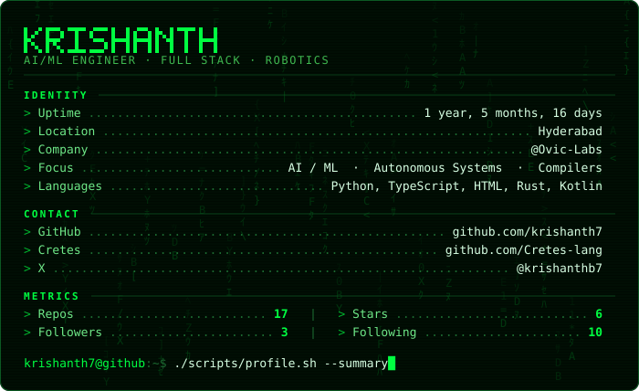

Rendered from live GitHub data by <code>./scripts/build-card.sh</code> · also available in <a href="profile/card/card-cyber.svg">cyber</a>

**Software Engineer** &nbsp;·&nbsp; Kotlin &nbsp;·&nbsp; Python &nbsp;·&nbsp; TypeScript &nbsp;·&nbsp; AI/ML

Creator of [**Cretes**](https://github.com/Cretes-lang) — a programming language for AI-native software.

